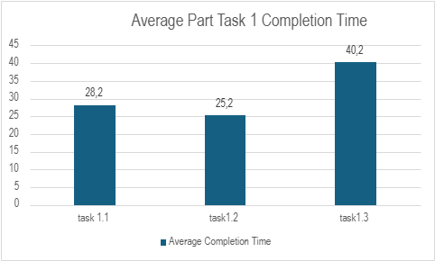
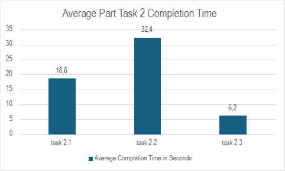
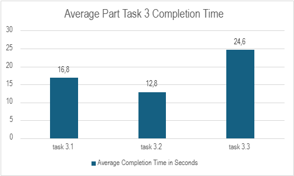
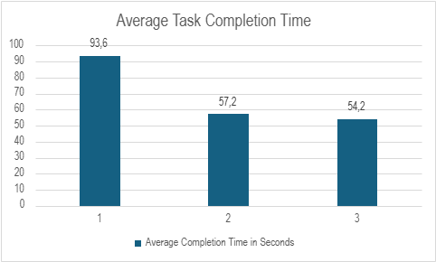

# Usability Test Plan for “Roomy”

## Test Setup
The goal of the usability test is to evaluate whether the navigation between groups and other core features of the app is intuitive for users, focusing on tasks such as account creation, managing groups, adding items, and changing user settings.

## Test Methods
- **Screen Recording**: The users' screens will be recorded to capture their interactions and challenges.
- **Observational Notes**: The moderator will take notes on user behaviors, reactions, and points of confusion.
- **Task Time**: Track how long it takes users to complete tasks.
- **Error Counting**: Document errors, such as failed attempts, incorrect selections, or misunderstandings of the interface.

## Target Group
- **Demographics**: Students between the ages of 18 and 30, and people living in households with others (i.e., potentially managing shared resources or group activities).
- **Target Users**: These users are familiar with apps, digital interfaces, and group-based features, making them a representative sample for usability testing.

## Hypothesis
We believe users will find it intuitive to navigate between different groups because the navigation bar is consistently placed and uses familiar icons.

## Metrics
- Success Rate
- Error Rate
- Think Aloud Observations
- Task Completion Time
- Single Ease Questionnaire (SEQ)

## Tasks
The tasks will be done step by step as outlined below. The success rate, error rate, and completion time will be tracked for each task. Task completion time will be recorded via screen recordings and evaluated afterward. After each task, participants will complete an SEQ questionnaire.

### Task 1: Create an Account and Create a Group
- Create an account.
- Create a group.
- Add the users “Jakob” and “Niklas” to the group.

### Task 2: Add Items and Get a Recipe
- Add “cola” to your shopping list.
- Add “banana” and “milk” to your inventory.
- Get a recipe based on items in the inventory.

### Task 3: Change Username, Delete an Item, and Remove Members
- Change your username.
- Delete an item from the group.
- Remove either “Jakob” or “Niklas” from the group.

## Heuristic Evaluation

### Visibility of System Status
- **Issue**: No feedback when the username field on the sign-up screen is empty.
  - **Solution**: Display a red text warning underneath the username input field for empty or invalid inputs.

### Match Between System and the Real World
- **Issue**: The “Add Group” button on the home screen is a small plus in the middle of the screen.
  - **Solution**: Move the button to a more familiar position, such as the bottom-right corner.
- **Issue**: The “Add User” button on the create group screen is inside the text field.
  - **Solution**: Place the button next to or below the text field.

### User Control and Freedom
- **Issue**: Misleading back arrows on side screens redirect users to the home screen instead of the previous screen.
  - **Solution**: Ensure the back button behaves like a standard back button on all screens.
- **Issue**: Group names cannot be changed after creation.
  - **Solution**: Allow the group creator to rename the group.
- **Issue**: Users can remove themselves from a group without confirmation.
  - **Solution**: Replace this with a “Leave Group” button requiring confirmation.

### Consistency and Standards
- **Issue**: Font sizes vary slightly between screens.
  - **Solution**: Use a standardized typography and font sizes across the app, defined in the theme file.

### Error Prevention
- **Issue**: Users can add duplicate members to a group.
  - **Solution**: Display an error message if the username is already in use.
- **Issue**: Groups can be created without a name.
  - **Solution**: Require a group name with at least three characters.

### Recognition Rather Than Recall
- No critical issues found.

### Flexibility and Efficiency of Use
- **Issue**: Users cannot add multiple items to the shopping list at once.
  - **Solution**: Implement a multi-add feature to improve efficiency.

### Aesthetic and Minimalist Design
- No critical issues found.

### Help Users Recognize, Diagnose, and Recover from Errors
- **Issue**: No guidance for adding items to the shopping list.
  - **Solution**: Add a short description when the shopping list is empty.
- **Issue**: No tutorial for deleting items from a list.
  - **Solution**: Add a brief guide after the first item is added and include a FAQ screen.

### Help and Documentation
- **Issue**: No in-app FAQ or help section.
  - **Solution**: Create a help section within the settings on the profile screen.

### Most Critical Issues Found
- User Control and Freedom: Confusing back arrows and the ability for a user to remove themselves from a group without confirmation.
- Error Prevention: Being able to add duplicate users or create a group without a name.
- Visibility of System Status: No feedback when mandatory fields (e.g., username) are empty.

## Results

### Participants
- **Number**: 5 volunteers.
- **Demographics**: All participants were within the target group (students, shared households) with a 40/60 gender distribution.
  
 

### Metrics
We collected the completion times for each Task and the smaller tasks within a task to see where we must improve. Before the start of the test, we designed tasks that must be done in under one minute and each small task in a time between 15 – 20 seconds.
In the charts we saw where we must improve efficiency to have a better and faster experience for the user. We were happy to see that the completion times matched our estimates.
As you can see below in the diagram the 1. Task had the highest average completion time which depends on the long loading time we had when we started our tests. The other Tasks were done under a minute which we think is a good time for the first experience doing tasks the app is made for.

## Most Useful Feedback and Problems Found

### Critical Issues
- Long loading time without feedback on sign-up. 
- Add members input field lacked clear description.
- Confusion about navigation between the bottom bar and header back arrow.
- Difficulty finding the “Add User” button due to inconsistent positioning.
- Add tips and guidance for first-time use (e.g., empty shopping list).
- Improve button placement for consistency.
- Enable group card holding for editing group members.
- Provide visual feedback for long loading times.

## Updates Made Based on Feedback
Since we carried out the user tests at the end of week 1, we got a lot of Information on what can be improved in the second half of the CCL. Most notable changes we implemented based on this feedback were:

### Changes Implemented
- Added tips and pointers for empty shopping lists.
- Fixed navigation inconsistencies.
- Enabled group card holding to access the Edit Members screen.
- Improved button placement and consistency.
- Reduced loading times when fetching groups.

## Conclusion
The usability tests provided valuable insights, helping us address issues and improve the user experience. By conducting tests early, we had ample time to implement changes and optimize the app's usability.
