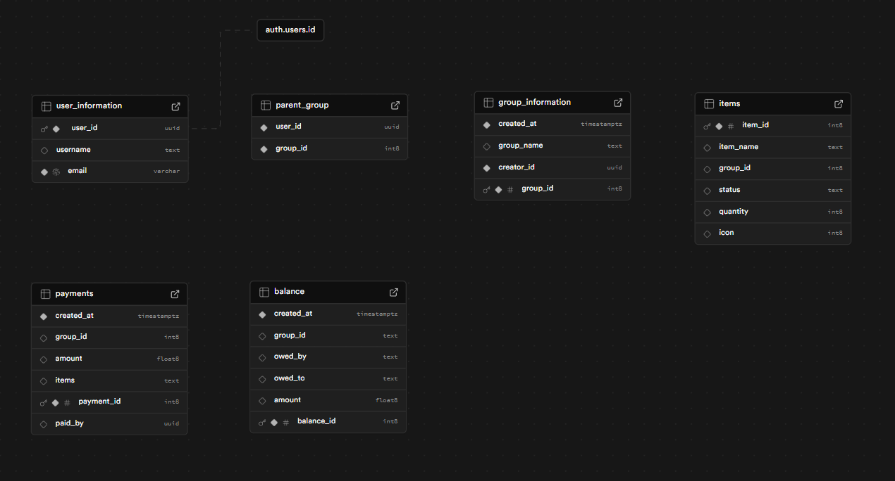

# Documentation 

### Database structure:

Our database includes an auth.user table which have all the login information and is connected to the user_information which has all the information of the user in it (e.g. username). Furthermore, we decided to have a parent_group table where all the users have their connection to a group. For all the group information we created a separate table to differentiate the group from the user.

We created a payments and balance table for all the financial documentation in the app. When a payment is created, it will also add a new balance.

E.g. if there are user x and user y in one group and user x buys something in the supermaket it will create a payment and a balance with user x (owed_by) owes user y (owed_to). If user x already lent user y something, then the amount gets increased otherwise if user y owes user y, then it will be decreased or deleted if the amount is smaller than 0 after the calculation. The amount will be divided between all the actual users in the group.

There is an item table for the items a user creates when they are not available in the app already. All Items have a group id included as well as an Icon id which lets us easily fetch and display all items from a group.

# Final thoughts: 

The final app meets the initial concept, and we've already added some additional features, such as AI recipe recommendations based on the items in the inventory. Furthermore, the fetch and update functions of the database could be improved, as well as the database structure (e.g., connecting tables in the database). Other potential improvements include adding a tutorial for first-time users, more customization options like changing the profile picture, theme, group colors, etc. However, there are still many features missing in the app that could enhance the user experience and improve its efficiency. We are happy with the base of the app and are motivated to continue working on it in the future, adding more features and possibly even developing it for iOS as well. Overall, we are really pleased with how the app turned out, and we are proud of the team for how well we structured the entire project, including time management and work distribution. The best part was definitely our little team-building event after the first week. 

### Reflection Niklas:

The first challenge I encountered was connecting Supabase to the app. I had to learn the syntax of the Supabase dependency to sign in and retrieve the session token for the current session. After I became familiar with Supabase integration in Kotlin, I began thinking about the database structure, which wasn’t a major issue because I had worked with databases on other projects. It took me a long time to figure out how to use Supabase with Kotlin, but I learned a lot during this process. Once the database integration was finished, we were able to display all the data of the logged-in user, including the groups they’re in, along with all the group information and members. The next big challenge was working on the balance calculation and update function with the database. This was complicated because, for example, if user X buys something for 12€, it means user Y and user Z in the group owe user X 4€ each. However, it could be that before this purchase, user X already owes user Y 13€ and user Z 3€. So, I had to think about the counterbalance and how to structure this in the database. This took me a lot of hours. The rest of the project wasn’t as challenging, as I had experience working with Kotlin in Android Studio from previous projects. 

### Reflection Jakob:

I started out on the first day with setting up the base Project Structure, Navigation, Screens, and basic UI. A challenge I encountered was making sure the App renders smoothly and as intended. Always waiting for a database's response led to delayed rendering and would feel off at times. I solved this by implementing a global Group State, which updates locally in sync with the database. In essence this allowed me to update all parts of the UI instantly by changing the state and updating the database in the background. The App would then fetch from the database only when reentering the Homepage or when the user pulls down to refresh the page.

I was also responsible for implementing the OpenAI API, which turned out to be quite a simple process.  The Retrofit Library simplified HTTP Requests with Kotlin, and after adding the API Key it worked out fine. Finetuning the prompt to make sure the response is adequate for our use case was a little tricky but a fun process overall.

Finally, styling the UI with Compose was very unintuitive at first. It is great for basic elements and quick layouts, but for more complex things (expanding item search bar, custom text fields) it was very time-consuming to get it exactly right.

Towards the End we improved a lot on utilizing compose and I am happy about how the app feels and looks now. 
