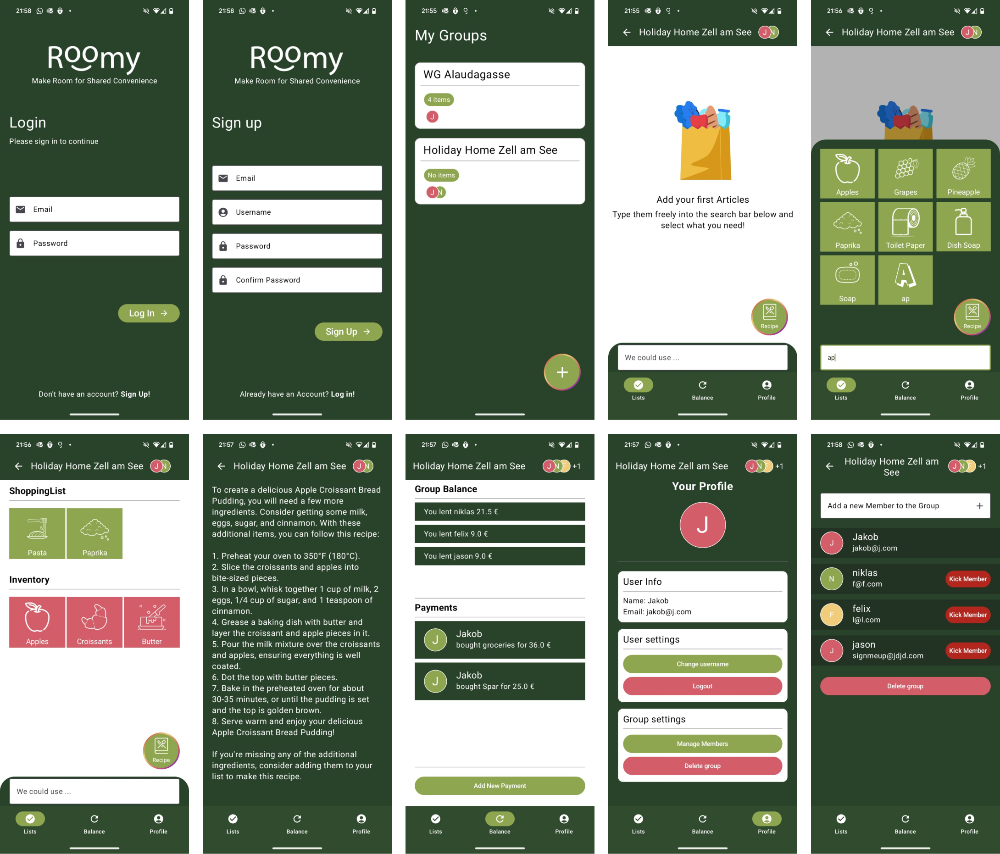

# Roomy

This project was created over the span of 2 weeks in the 3rd Creative Code Lab of BCC-FHSTP.

[Niklas Erath](https://github.com/NiklasErath) and [Jakob Huber](https://github.com/cc231025)

# Instructions

To run the App on your phone, download and install the APK located in the APK Folder in the root directory or click on the Download Link in the header.

Unfortunately as of now the Feature to generate a Recipe is not available in the APK file, since the key will get blocked automatically when included in the public git repository.
A separate server to handle the requests between the App and OpenAI is needed, which will be a future addition.

To access the OpenAI Recipe Feature with your own API key add this line in your gradle.properties file

OPENAI_API_KEY=yourkey

Clean, Sync and Rebuild the Project

# App Concept

Managing shared responsibilities has never been easier! With our app, streamline finances, shopping lists, and group coordination all in one place. Whether you’re sharing a space with family, friends, or roommates, stay organized and stress-free with these key features:

Seamless Onboarding: Start with a simple login or account creation screen to secure and personalize your experience.

Group Dashboard: Access all your groups in one place, ensuring you can switch between them effortlessly.

Group Balance: Track shared expenses effortlessly. Add payments, and the app automatically splits costs evenly across group members. Never lose track of who owes what.

Shared Shopping List: Add groceries and items to the group shopping list. Mark items as purchased so everyone stays updated.

Inventory Tracker: Keep tabs on what’s already in the fridge/shelf to avoid duplicate purchases or forgotten essentials.

Generate Custom Recipes: In need of ideas for what to cook with your left-overs at home? Generate an individual Recipe based on what you have at home with the press of a button.

Profile Management: Create a profile, connect with other users, and manage multiple groups with ease.

# Target group:  
Perfect for families, roommates, or any shared living or collaboration setup, this app eliminates the hassle of managing group finances and grocery lists. Save time, avoid misunderstandings, and make group collaboration smooth and efficient.

Stay organized, stay balanced, and focus on what matters most—your group.

# Final Screenshots and Screen Recording

<video width="640" height="360" controls>
  <source src="images/screenrecording.mp4" type="video/mp4">
  Your browser does not support the video tag.
</video>

